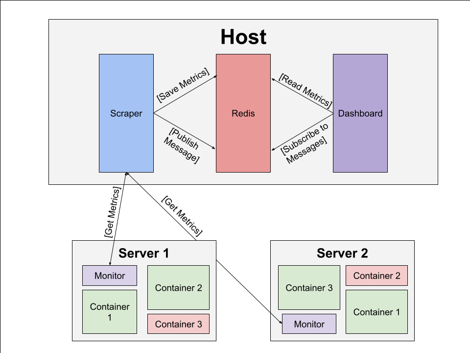
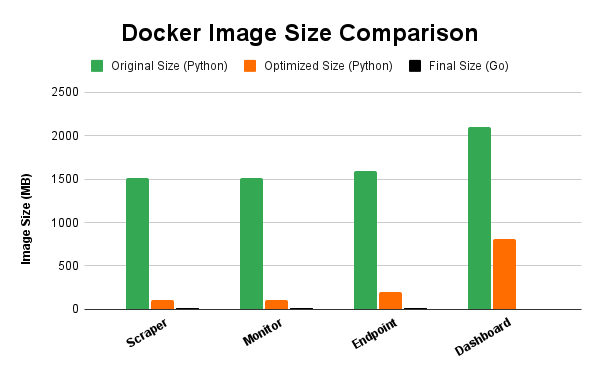

# Distributed-Monitoring

**A scalable, real-time Docker container monitoring system for distributed environments.**

This project provides a production-ready, resource-efficient monitoring solution for containerized environments. It leverages concurrent Go services, asynchronous Python scripts, Redis caching, and a modular microservices architecture to track system load, container health, and resource usage across multiple remote systems.

## Features

- Real-time monitoring of Docker containers across distributed systems
- Microservices-based design for modularity and scalability
- Lightweight container images using multi-stage builds and static binaries
- Efficient concurrent programming using Go and Python (`asyncio`)
- Redis-based publish-subscribe model for low-latency updates
- HTTP REST API endpoints for scraping system metrics
- Support for CPU, memory, disk I/O, network I/O and latency monitoring
- Easily configurable and platform-independent via Docker and Docker Compose

## System Architecture

---

## Components

### Monitor

Each remote system runs a `monitor` container, built in Go, which uses the Docker SDK to retrieve:

- CPU usage
- Memory consumption
- Disk I/O statistics
- Network traffic

The monitor exposes a REST API endpoint that serves this information to the host system.

Key technologies:
- Concurrency with goroutines/asyncio
- Docker SDK
- Statically compiled binary

---

### Scraper

The host system runs a `scraper` container that asynchronously pings each monitor's REST API to collect metrics. These are stored in a Redis cache for centralized access.

Key technologies:
- Periodic asynchronous HTTP polling
- Minimal memory footprint through optimized docker builds

---

### Redis

The host system runs a `redis` container, an in-memory data store to hold the latest system metrics. Enables low-latency data access for downstream services via publish-subscribe.

Key technologies:
- Key-value storing
- In-memory data storage
- Publisher-substriber model

---

### Dashboard

The host system runs a `dashboard` container that subscribes to the Redis container. It receives and visualizes real-time container statistics. It is written with streamlit.

Key technologies:
- Redis subscriptions
- Live data visualization using matplotlib
- Optimized Python containers via multi-stage builds

## Docker Optimizations

This project makes use of:
- Slim base images for small standard builds
- Multi-stage builds to remove build dependencies from final image
- Go static compilation to massively reduce image size
   - It is worth noting that the dashboard was not programmed in Go

| Component | Original Size (Python) | Optimized Size (Python) | Final Size (Go) | Size Reduction (Python) | Size Reduction (Overall) |
|-----------|------------------------|-------------------------|-----------------|-------------------------|--------------------------|
| Scraper   | 1,510 MB               | 107 MB                  | 14 MB           | 92.9 %                  | 99.1 %                   |
| Monitor   | 1,510 MB               | 109 MB                  | 20 MB           | 92.8 %                  | 98.7 %                   |
| Endpoint  | 1,590 MB               | 200 MB                  | 17 MB           | 87.4 %                  | 98.9 %                   |
| Dashboard | 2,100 MB               | 815 MB                  | N/A             | 61.2 %                  | N/A                      |

## Usage

### Prerequisites

- Docker
- Python

---

### Setup

1. Clone the repository (or the scripts and distributed-monitor folders)
2. Use the available scripts to launch the host, configure it, and launch the monitors in the language of your choice

---

### Scripts

**build_containers.sh:** Compile and build all project scripts into container images

**endpoint_launch.sh:** Launch a sample endpoint on a specified port for testing

**monitor_launch.sh:** Launch the monitor container for a system

**startup.sh:** Process the config to set environment variables and launch the containers with docker-compose
   
